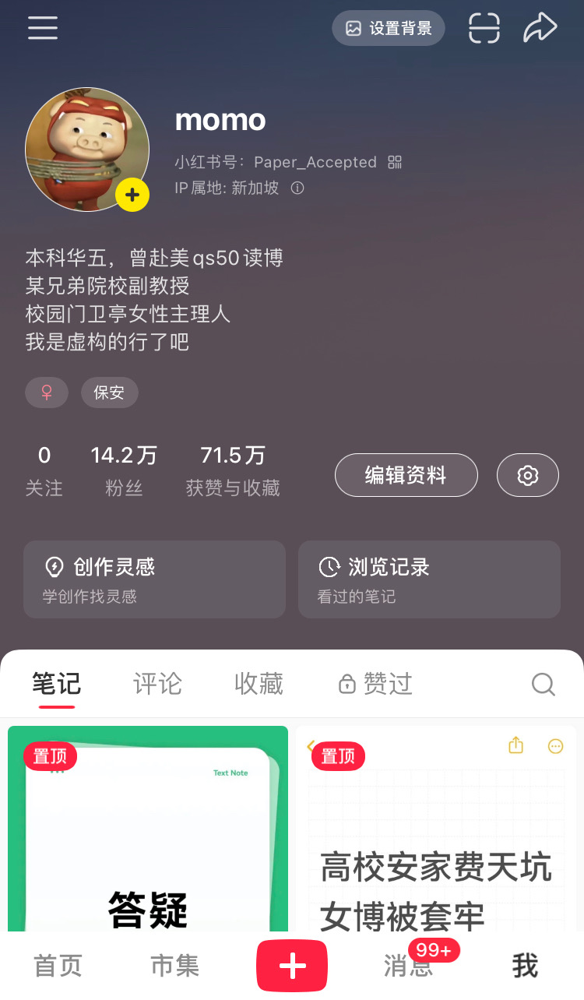
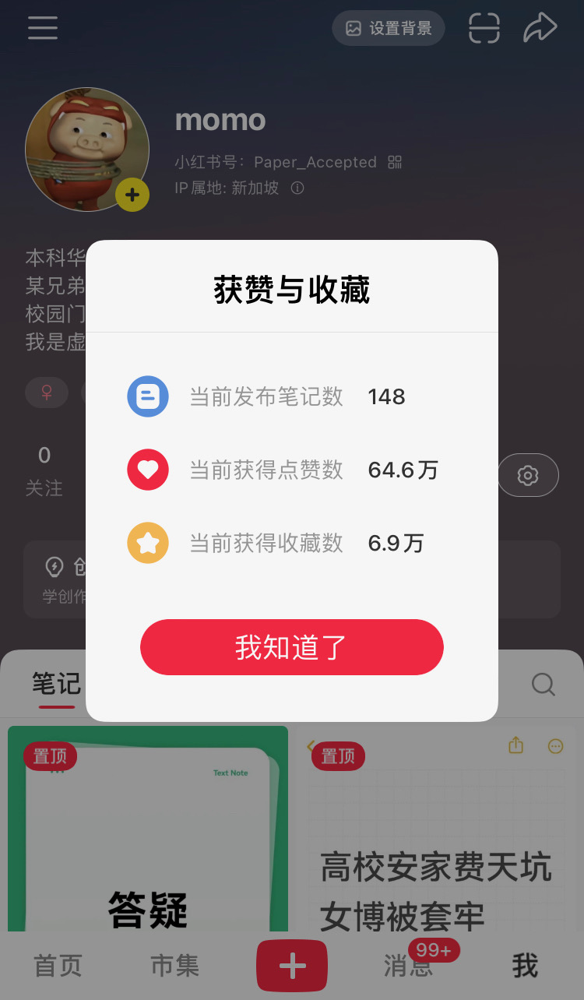
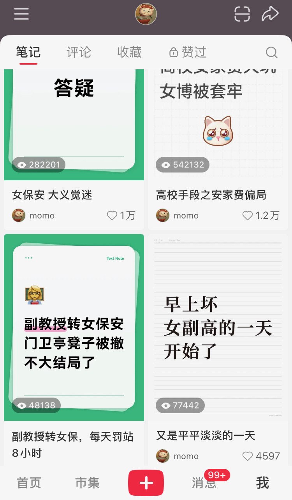

# I Can’t Hold On Anymore: A Final Warning and a "Restart"

> **Notice:** I will not be updating new content here frequently. However, if my Xiaohongshu (Little Red Book) account truly vanishes, I will announce my new platform handle here. Thank you all for your support.

---

### **About Me**

* **Education**: Undergraduate at a "Top 5" university in East China (C9 League); PhD from a QS Top 50 university in the US.
* **Career**: Former Associate Professor at a "brother" university; currently the primary attendant of a campus security booth.
* **Note**: This is a backup platform to prevent being silenced (炸号).

---

### **The Reality of the Experience**

I used to be an Associate Professor at a university. My year-end performance bonus was about **6,000 RMB (860 USD)**, and my monthly salary was **4,000 RMB (574 USD)**. Later, I was transferred to a campus security role. My daily routine now involves patrolling the campus, chasing away delivery drivers, and feeding the stray cats.

**Ironically, my monthly take-home pay increased by 800 RMB in this role.** I’ve spent my whole life studying, yet I still don't understand what it was all for.

The reason I apologized publicly recently is that my "ex-husband" (likely a former colleague or partner) is still struggling with his academic evaluations. The school pressured me, claiming my posts were affecting his 6,000 RMB year-end bonus. Initially, they asked me not to mention the school's name; I figured academia here is a mess anyway, so it didn't matter. But when they saw how quickly I agreed, they actually asked if I could **put the name of a different "brother" institution in the apology instead.** I was literally laughed to tears on the spot.

Later, the chair in my guard booth was taken away. Leadership ordered it removed for a simple reason: **"Security guards are not allowed to sit; it looks bad."** Now, I have to stand for 8 hours straight. I am truly at the end of my rope.

---

### **Institutional Intimidation**

Over the weekend, the school sent **seven different leaders** to my rented apartment in shifts to "talk" to me, terrifying my roommate's kitten. They forbid me from revealing even a hint of the school's name and demanded I declare all my content as "fictional." Otherwise, they threatened to **immediately "claw back" all the salary and subsidies I have ever received.** When I said this wasn't in the agreement, they said, "Don't worry, the school has plenty of ways." They even said, "Academic reputations here are already trashed—if it’s going to rot, let’s all rot together." Finally, they warned me not to gain any more followers. I said I can't control that; they replied that they have "ways" to make followers unfollow me.

---

### **A Warning to Future Scholars**

If you have read this far, this message is likely for you. Whether you want to enter academia, pursue a PhD, or have friends and family considering it—I hope you can take my experience as a warning. I don't expect to change anything for myself, but I hope my "burning embers" can light the way and help you avoid the pitfalls.

Don't worry about which school it is anymore; **they are all the same.** Please refer to my "Q&A notes." The school has started "applying magic" (censorship/shadowbanning) these past two days; many of my notes are now only visible to me, and many friends found they were "automatically" forced to unfollow me.

**Take screenshots while you can; you might not see this again.**

---

### **Cultural Context & Slang Notes:**

* **"Restart" (重开):** Internet slang for "reincarnation" or starting life over, usually carrying a tone of deep despair.
* **"Top 5" (华五):** Refers to the five elite universities in East China (typically Fudan, SJTU, Zhejiang, Nanjing, and USTC), second only to Tsinghua and Peking University.
* **"Magic" (上魔法):** Slang for backend technical interference by platforms or authorities to suppress content.

## Posting some Xiaohongshu screenshots as follows:

